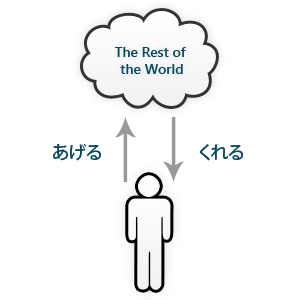

## Japanese people like gifts

### Vocabulary

++{お歳暮|お・せい・ぼ}++
: year-end presents

++{お中元|お・ちゅう・げん}++
: Bon festival gifts

++あげる++
: to give; to raise (ru-verb)

++くれる++
: to give (ru-verb)

++もらう++
: to receive (u-verb)

One thing about Japanese culture is that they’re big on giving gifts. There are many different customs involving giving and receiving gifts (お歳暮、お中元、etc.) and when Japanese people go traveling, you can be sure that they’re going to be picking up souvenirs to take back as gifts. Even when attending marriages or funerals, people are expected to give a certain amount of money as a gift to help fund the ceremony. You can see why properly learning how to express the giving and receiving of favors and items is a very important and useful skill. For some reason, the proper use of ""あげる""、""くれる""、and ""もらう"" has always haunted people studying Japanese as being horribly complex and intractable. I hope to prove in this section that it is conceptually quite straightforward and simple.

## When to use ""あげる""

### Vocabulary

++あげる++
: to give; to raise (ru-verb)

++{私|わたし}++
: me; myself; I

++{友達|とも・だち}++
: friend

++{プレゼント|pu re ze n to}++
: present

++これ++
: this

++{先生|せん・せい}++
: teacher

++{車|くるま}++
: car

++{買う|か・う}++
: to buy (u-verb)

++{代わり|か・わり}++
: substitute

++{行く|い・く}++
: to go (u-verb)

++{学生|がく・せい}++
: student

++{父|ちち}++
: father

++いい++
: good (i-adj)

++こと++
: event, matter

++{教える|おし・える}++
: to teach; to inform (ru-verb)

""あげる"" is the Japanese word for “to give” seen from the speaker’s point of view. You must use this verb when you are giving something or doing something for someone else.

### Examples

1. 私が友達にプレゼントを==あげた==。  
   I gave present to friend.

1. これは先生に==あげる==。  
   I’ll give this to teacher.

In order to express the giving of a favor (verb) you must use the ever useful te-form and then attach ""あげる"". This applies to all the other sections in this lesson as well.

1. 車を==買ってあげる==よ。  
   I’ll give you the favor of buying a car.

1. 代わりに==行ってあげる==。  
   I’ll give you the favor of going in your place.

For third-person, this verb is used when the speaker is looking at it from the giver’s point of view. We’ll see the significance of this when we examine the verb ""くれる"" next.

1. 学生がこれを先生に==あげる==。  
   The student give this to teacher. (looking at it from the student’s point of view)

1. 友達が父にいいことを==教えてあげた==。  
   Friend gave the favor of teaching something good to my dad. (looking at it from the friend’s point of view)

## Using ""やる"" to mean ""あげる""

### Vocabulary

++{犬|いぬ}++
: dog

++{餌|えさ}++
: food for animals

++やる++
: to do (u-verb)

Usually used for pets, animals, and such, you can substitute ""やる"", which normally means “to do”, for ""あげる"". You shouldn’t use this type of ""やる"" for people because it is used when looking down on someone and can be offensive.

- 犬に餌を==やった==？  
   Did you give the dog food?

Here, ""やる"" does not mean “to do” but “to give”. You can tell because “doing food to dog” doesn’t make any sense.

## When to use ""くれる""

### Vocabulary

++くれる++
: to give (ru-verb)

++{友達|とも・だち}++
: friend

++{私|わたし}++
: me; myself; I

++{プレゼント|pu re ze n to}++
: present

++これ++
: this

++{先生|せん・せい}++
: teacher

++{車|くるま}++
: car

++{買う|か・う}++
: to buy (u-verb)

++{代わり|か・わり}++
: substitute

++{行く|い・く}++
: to go (u-verb)

++{学生|がく・せい}++
: student

++{父|ちち}++
: father

++いい++
: good (i-adj)

++こと++
: event, matter

++{教える|おし・える}++
: to teach; to inform (ru-verb)

++あげる++
: to give; to raise (ru-verb)

++{全部|ぜん・ぶ}++
: everything

++{食べる|た・べる}++
: to eat (ru-verb)

""くれる"" is also a verb meaning “to give” but unlike ""あげる"", it is from the receiver’s point of view. You must use this verb when someone else is giving something or doing something for you (effectively the opposite of ""あげる"").

### Examples

1. 友達が私にプレゼントを==くれた==。  
   Friend gave present to me.

1. これは、先生が==くれた==。  
   Teacher gave this to me.

1. 車を==買ってくれる==の？  
   You’ll give me the favor of buying a car for me?

1. 代わりに==行ってくれる==？  
   Will you give me the favor of going in my place?

Similarly, when used in the third-person, the speaker is speaking from the receiver’s point of view and not the giver.

1. 先生がこれを学生に==くれる==。  
   The teacher give this to student. (looking at it from the student’s point of view)

1. 友達が父にいいことを==教えてくれた==。  
   Friend gave favor of teaching something good to my dad. (looking at it from the dad’s point of view)

The following diagram illustrates the direction of giving from the point of view of the speaker.

Figure: Favor Diagram

From the speaker’s point of view, all the giving done to others “go up” to everybody else while the giving done by everybody else “goes down” to the speaker. This is probably related to the fact that there is an identical verb ""上げる"" meaning “to raise” that contains the character for “above” (上) and that the honorific version of ""くれる"" is ""下さる"" with the character for down (下). This restriction allows us to make certain deductions from vague sentences like the following:

- 先生が教えて==あげる==んですか。  
   Teacher, will you be the one to give favor of teaching to… [anybody other than the speaker]?

Because all giving done to the speaker must always use ""くれる"", we know that the teacher must be doing it for someone else and not the speaker. The speaker is also looking at it from the teacher’s point of view as doing a favor for someone else.

- 先生が教えて==くれる==んですか。  
   Teacher, will you be the one to give favor of teaching to… [anybody including the speaker]?

Because the giver is not the speaker, the teacher is either giving to the speaker or anyone else. The speaker is viewing it from the receiver’s point of view as receiving a favor done by the teacher.

Let’s see some mistakes to watch out for.

- 私が全部食べて~~くれました~~。  
   ""くれる"" is being used as giving done by the speaker. (Wrong)

- 私が全部食べて==あげました==。  
   I gave favor of eating it all. (Correct)

- 友達がプレゼントを私に~~あげた~~。  
   ""あげる"" is being used as giving to the speaker. (Wrong)

- 友達がプレゼントを私に==くれた==。  
   Friend gave present to me. (Correct)

## When to use ""もらう""

### Vocabulary

++{私|わたし}++
: me; myself; I

++{友達|とも・だち}++
: friend

++{プレゼント|pu re ze n to}++
: present

++もらう++
: to receive (u-verb)

++これ++
: this

++{買う|か・う}++
: to buy (u-verb)

++{宿題|しゅく・だい}++
: homework

++{チェック|che k ku}++
: check

++する++
: to do (exception)

++{時間|じ・かん}++
: time

++ある++
: to exist (inanimate) (u-verb)

++{無理|む・り}++
: impossible

++その++
: that （abbr. of それの）

++{時計|と・けい}++
: watch; clock

""もらう"" meaning, “to receive” has only one version unlike ""あげる／くれる"" so there’s very little to explain. One thing to point out is that since you receive from someone, ""から"" is also appropriate in addition to the ""に"" target particle.

### Examples

1. 私が友達==に==プレゼントを==もらった==。  
   I received present from friend.

1. 友達==から==プレゼントを==もらった==。  
   I received present from friend.

1. これは友達に==買ってもらった==。  
   About this, received the favor of buying it from friend.

1. 宿題をチェック==してもらいたかった==けど、時間がなくて無理だった。  
   I wanted to receive the favor of checking homework but there was no time and it was impossible.

""もらう"" is seen from the perspective of the receiver, so in the case of first-person, others usually don’t receive things from you. However, you might want to use ""私からもらう"" when you want to emphasize that fact that the other person received it from you. For instance, if you wanted to say, “Hey, I ==gave== you that!” you would use ""あげる"". However, you would use ""もらう"" if you wanted to say, “Hey, you ==got== that from me!”

- その時計は私からもらったのよ。  
   (He) received that watch from me.

## Asking favors with ""くれる"" or ""もらえる""

### Vocabulary

++{千円|せん・えん}++
: 1,000 yen

++{貸す|か・す}++
: lend (u-verb)

++する++
: to do (exception)

++くれる++
: to give (ru-verb)

++もらう++
: to receive (u-verb)

++あなた++
: you

++{私|わたし}++
: me; myself; I

++ちょっと++
: a little

++{静か|しず・か}++
: quiet (na-adj)

++{漢字|かん・じ}++
: Kanji

++{書く|か・く}++
: to write (u-verb)

You can make requests by using ""くれる"" and the potential form of ""もらう"" (can I receive the favor of…). We’ve already seen an example of this in example 4 of the ""くれる"" section. Because requests are favors done for the speaker, you cannot use ""あげる"" in this situation.

### Examples

1. 千円を貸してくれる？  
   Will you give me the favor of lending 1000 yen?

1. 千円を貸してもらえる？  
   Can I receive the favor of you lending 1000 yen?

Notice that the two sentences essentially mean the same thing. This is because the giver and receiver has been omitted because it is obvious from the context. If we were to write out the full sentence, it would look like this:

1. ==あなたが==、==私に==千円を貸してくれる？  
   Will you give me the favor of lending 1000 yen?

1. ==私が==、==あなたに==千円を貸してもらえる？  
   Can I receive the favor of you lending 1000 yen?

It is not normal to explicitly include the subject and target like this when directly addressing someone but is provided here to illustrate the change of subject and target depending on the verb ""くれる"" and ""もらえる"".

You can use the negative to make the request a little softer. You’ll see that this is true in many other types of grammar.

1. ちょっと静かにして==くれない==？  
   Won’t you be a little quieter?

1. 漢字で書いて==もらえません==か。  
   Can you write this in kanji for me?

## Asking someone to not do something

### Vocabulary

++{全部|ぜん・ぶ}++
: everything

++{食べる|た・べる}++
: to eat (ru-verb)

++くれる++
: to give (ru-verb)

++{高い|たか・い}++
: high; tall; expensive (i-adj)

++{物|もの}++
: object

++{買う|か・う}++
: to buy (u-verb)

In order to request that someone not do something, you simply attach ""で"" to the negative form of the verb and proceed as before.

1. 全部食べない==で==くれますか。  
   Can you not eat it all?

1. 高い物を買わない==で==くれる？  
   Can you not buy expensive thing(s)?
